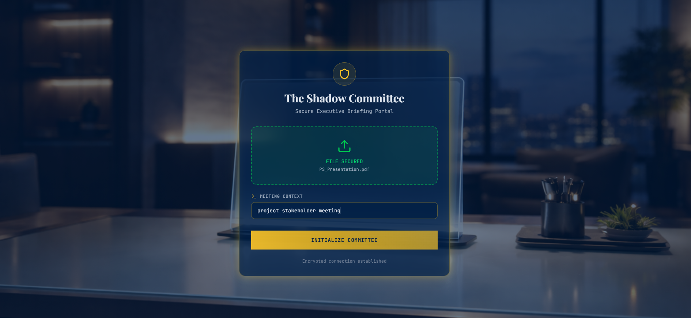
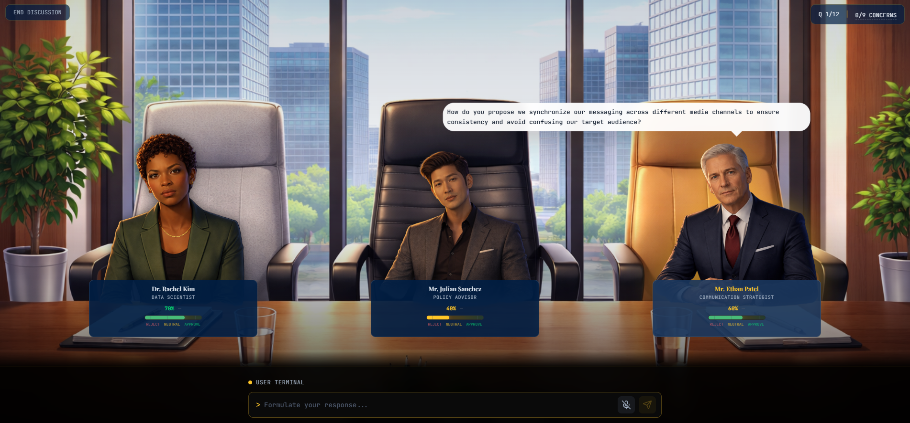
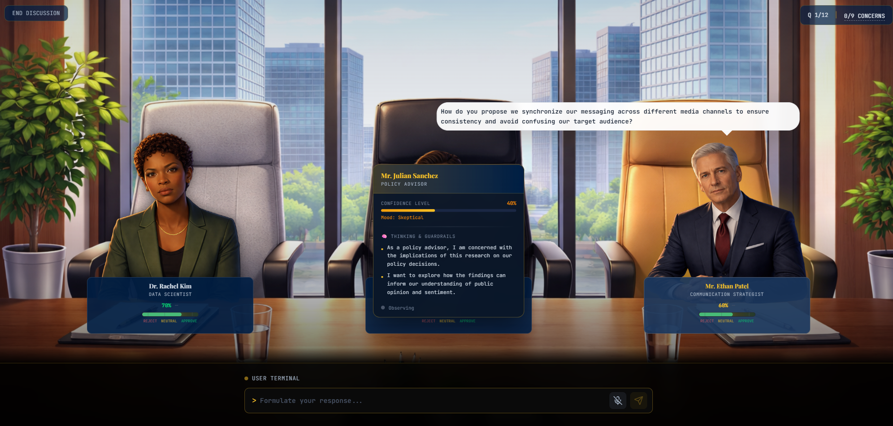
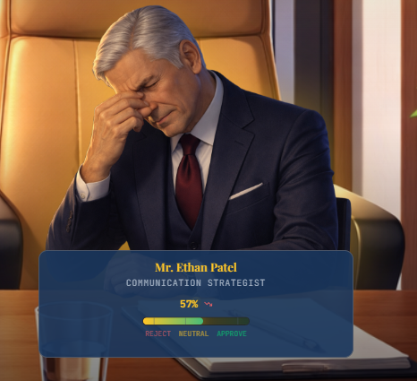
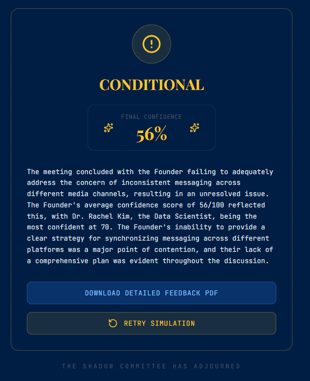

# The Shadow Committee

**Adversarial AI Boardroom Simulation for Decision Resilience**

---

## Table of Contents

- [Overview](#overview)
- [The Problem](#the-problem)
- [The Solution](#the-solution)
- [Core Innovation: Context-Aware Persona Generation](#core-innovation-context-aware-persona-generation)
- [Application Flow](#application-flow)
- [Key Concepts](#key-concepts)
- [Technical Architecture](#technical-architecture)
- [Tech Stack](#tech-stack)
- [Getting Started](#getting-started)
- [Environment Variables](#environment-variables)
- [Project Structure](#project-structure)
- [License](#license)

---

## Overview

The Shadow Committee is an adversarial AI simulation platform that replicates the pressure, skepticism, and scrutiny of a high-stakes boardroom. Users upload their pitch decks, project proposals, or stakeholder briefs, and the system generates a panel of context-aware AI personas, each embodying a distinct critical perspective drawn directly from the user's domain. The goal is not to help users finish their projects. The goal is **Decision Resilience**: the confidence that comes from having already survived every possible reason a plan might fail.

> *Iron sharpens iron.*

---

## The Problem

In the real world, stakeholders do not want to help you; they want to protect their interests. Yet, preparation for high-stakes meetings overwhelmingly relies on AI tools that are programmed to be agreeable, supportive, and non-confrontational. This creates a dangerous false sense of security.

- **Polite AI produces fragile founders.** When AI validates ideas by default, critical blind spots go undetected until they surface in a room where the consequences are real.
- **Billions in capital and thousands of hours are lost** to projects that were never stress-tested against the specific skepticisms of their industry.
- **Judgment is a muscle, and muscles only grow under tension.** Current AI tools have stripped away the productive friction that builds genuine preparedness.

---

## The Solution

The Shadow Committee introduces **Adversarial AI** into the preparation process. Rather than offering encouragement, it generates the specific antagonists a user will face in the real world, then forces the user to defend their logic, composure, and ethics under simulated pressure.

The platform does not give generic advice. It identifies the three most dangerous perspectives for a specific project and constructs AI-driven personas that interrogate the user in real time. Users see visual feedback as persona confidence shifts, facial expressions change from receptive to hostile, and a Logic Integrity score rises or falls with each response.

The end state moves the needle from *"I think this works"* to *"I have survived every possible reason this will not work."*

---

## Core Innovation: Context-Aware Persona Generation

Most simulations are static. The Shadow Committee is fluid.

When a user uploads a deck or a stakeholder brief, the AI does not just read it -- it **audits** it. It identifies the three most dangerous perspectives for the specific project at hand and constructs personas accordingly:

| Uploaded Material | Generated Committee |
|---|---|
| FinTech pitch deck | Compliance Officer, High-Frequency Trader, Skeptical Consumer Advocate |
| Sustainability proposal | Environmental Ethicist, Supply-Chain Realist, Cost-Obsessed CFO |
| Healthcare product brief | Clinical Trial Regulator, Patient Rights Advocate, Hospital Procurement Director |

This process, referred to internally as **Adversarial Ingestion**, means each simulation is uniquely calibrated to surface the specific vulnerabilities of the material presented.

---

## Application Flow

The simulation progresses through four distinct phases, each designed to build increasing pressure and deliver actionable feedback.

### Phase 1 -- Document Upload and Briefing

The user begins by uploading a PDF document (pitch deck, proposal, research brief) and providing a meeting context (e.g., "Series A Pitch," "Board Review," "Project Stakeholder Meeting"). The system ingests the material through its adversarial parsing pipeline.



The upload interface operates as a secure briefing portal. Once the document is ingested and the meeting context is set, the user initializes the Committee, triggering the AI persona generation process.

---

### Phase 2 -- Committee Assembly and Persona Overview

The AI analyzes the uploaded material and generates three distinct adversarial personas, each assigned a domain-specific role, an individualized evaluation prompt, a set of concerns derived from gaps in the submitted material, and a calibrated initial confidence level.



Each persona is seated in a photorealistic boardroom environment. Their name cards display their role, current confidence percentage, and a tri-state sentiment indicator (Reject / Neutral / Approve). The active interrogator is highlighted, and their question appears in a speech bubble above the panel.

---

### Phase 3 -- Adversarial Cross-Examination

The core simulation loop begins. Personas take turns interrogating the user, with selection driven by a weighted algorithm that prioritizes personas with lower confidence, more remaining question capacity, and more unresolved concerns. A dampening factor prevents the same persona from speaking in consecutive turns.



Clicking on an active persona reveals their internal evaluation card, which surfaces their thinking and guardrails, current mood classification, and the specific concerns driving their line of questioning. This transparency allows users to understand what each persona is looking for and adapt their strategy accordingly.

The user responds through the terminal-style input at the bottom of the screen, with support for both text input and voice-to-text via microphone. Each response is evaluated by the AI in real time against the persona's evaluation criteria, the meeting context, and the full conversation history.

---

### Phase 4 -- Limbic Stress Simulation

As the interrogation proceeds, the system employs **Limbic Stress Simulation** -- visual feedback mechanisms designed to test the human behind the numbers, not just the numbers themselves.



When a response fails to satisfy a persona's concerns, their confidence score drops, an animated delta indicator appears (displaying the exact score change), and their facial expression shifts -- from composed professionalism to visible frustration or disappointment. This visual pressure forces the user to maintain composure and think clearly under adversarial conditions, mirroring the real-world experience of watching a stakeholder's demeanor shift mid-presentation.

---

### Phase 5 -- Verdict and Debrief

Once the simulation concludes (triggered by concern resolution, turn limits, or extreme confidence thresholds), the system delivers a comprehensive verdict.



The results phase presents:

- **Final Confidence Score**: The averaged confidence across all three personas.
- **Verdict Classification**: APPROVED (70%+), CONDITIONAL (40-69%), or DECLINED (below 40%).
- **Executive Summary**: An AI-generated narrative analyzing the user's performance, identifying points of strength and contention across the entire session.
- **Downloadable Dossier**: A detailed PDF report containing per-persona evaluations, turn-by-turn cross-examination logs with score deltas, and strategic recommendations.

---

## Key Concepts

**Adversarial Ingestion**
The AI does not just read the uploaded PDF; it identifies the weakest link in the material and constructs its attack vectors around those gaps.

**Limbic Stress Simulation**
By employing real-time visual feedback -- facial expression swaps, animated confidence drops, and mood indicators -- the platform tests the emotional resilience of the human behind the data, not just the data itself.

**Synthetic Skepticism**
The system leverages AI pattern recognition to surface the "shadows" that the human mind naturally overlooks: implicit assumptions, unstated dependencies, and logical gaps that only become visible under structured adversarial pressure.

**Decision Resilience**
The ultimate output is not a score or a report. It is the measurable shift from "I think this works" to "I have survived every possible objection to this working."

---

## Technical Architecture

```
Client (Next.js + React)
    |
    |--- Briefing Phase -----> POST /api/briefing
    |                              |-- PDF parsing (pdf-parse)
    |                              |-- Persona generation (Groq / LLaMA 3.3 70B)
    |                              |-- Concern extraction & confidence calibration
    |
    |--- Boardroom Phase ----> POST /api/question
    |                              |-- Concern-driven question generation
    |                          POST /api/evaluate
    |                              |-- Response scoring & emotion classification
    |                              |-- Cross-persona concern resolution
    |                              |-- Dynamic concern injection
    |                          POST /api/tts
    |                              |-- ElevenLabs text-to-speech streaming
    |
    |--- Results Phase ------> POST /api/conclude
                                   |-- Full-session analysis
                                   |-- Per-persona feedback synthesis
                                   |-- PDF dossier generation (jsPDF)
```

### Orchestration Engine

The boardroom phase is governed by a concern-driven orchestration engine that manages:

- **Weighted Persona Selection**: A probabilistic algorithm considers each persona's current confidence, remaining question capacity, and unresolved concerns to determine who speaks next.
- **Concern Lifecycle**: Each persona begins with three domain-specific concerns. Concerns transition through states: uncovered, covered (question asked), and resolved (satisfactory answer confirmed by the LLM). New concerns can be dynamically injected mid-session if the founder's responses reveal additional gaps.
- **Cross-Persona Resolution**: A strong answer to one persona can simultaneously resolve related concerns held by other personas, reflecting how a single well-articulated point can shift sentiment across an entire boardroom.
- **Game Termination Logic**: The simulation ends when all concerns are resolved, the maximum turn limit (12) is reached, average confidence hits an extreme threshold (below 10% or above 90%), or no eligible personas remain with unasked questions.

---

## Tech Stack

| Layer | Technology |
|---|---|
| Framework | Next.js 16 (App Router) |
| Language | TypeScript |
| UI | React 19, Framer Motion |
| Styling | Tailwind CSS 4 |
| Component Library | Radix UI Primitives, shadcn/ui |
| LLM Backend | Groq Cloud (LLaMA 3.3 70B Versatile) |
| Voice Synthesis | ElevenLabs TTS API |
| PDF Parsing | pdf-parse |
| Report Generation | jsPDF |
| Deployment | Vercel |

---

## Getting Started

### Prerequisites

- Node.js 18+
- npm or yarn
- A [Groq](https://console.groq.com/) API key
- An [ElevenLabs](https://elevenlabs.io/) API key (optional, for voice synthesis)

### Installation

```bash
git clone https://github.com/your-username/shadow-committee.git
cd shadow-committee
npm install
```

### Configuration

Create a `.env.local` file in the project root:

```env
GROQ_API_KEY=your_groq_api_key_here
ELEVENLABS_API_KEY=your_elevenlabs_api_key_here
```

### Running Locally

```bash
npm run dev
```

The application will be available at `http://localhost:3000`.

---

## Environment Variables

| Variable | Required | Description |
|---|---|---|
| `GROQ_API_KEY` | Yes | API key for Groq Cloud LLM inference |
| `ELEVENLABS_API_KEY` | No | API key for ElevenLabs voice synthesis (TTS features will be disabled without this) |

---

## Project Structure

```
shadow-committee/
├── app/
│   ├── api/
│   │   ├── briefing/        # PDF ingestion + persona generation
│   │   ├── question/        # Concern-driven question generation
│   │   ├── evaluate/        # Response scoring + concern resolution
│   │   ├── answer/          # Legacy answer evaluation endpoint
│   │   ├── conclude/        # Post-session analysis + report synthesis
│   │   ├── tts/             # ElevenLabs text-to-speech proxy
│   │   └── voices/          # Voice configuration endpoint
│   ├── globals.css
│   ├── layout.tsx
│   └── page.tsx             # Root page with phase state machine
├── components/
│   ├── boardroom-phase.tsx   # Core simulation loop + orchestration engine
│   ├── briefing-phase.tsx    # Document upload + context input
│   ├── confidence-meter.tsx  # Per-persona confidence visualization
│   ├── dialogue-hud.tsx      # User input terminal (text + voice)
│   ├── judge.tsx             # Persona rendering + emotion states
│   ├── results-phase.tsx     # Verdict display + PDF export
│   ├── transition-phase.tsx  # Loading transition between phases
│   └── ui/                   # Shared UI primitives (shadcn/ui)
├── hooks/
├── lib/
├── public/
│   ├── room.png              # Boardroom background environment
│   ├── person[1-3]_*.png     # Persona emotion state images
│   └── preboardroom.png      # Briefing phase background
├── .env.local
├── package.json
└── tsconfig.json
```

---

## License

This project was built for DevHacks 3. All rights reserved.

---

*The Shadow Committee: No one walks into a high-stakes room alone. You walk in with the confidence of someone who has already survived the Committee.*
